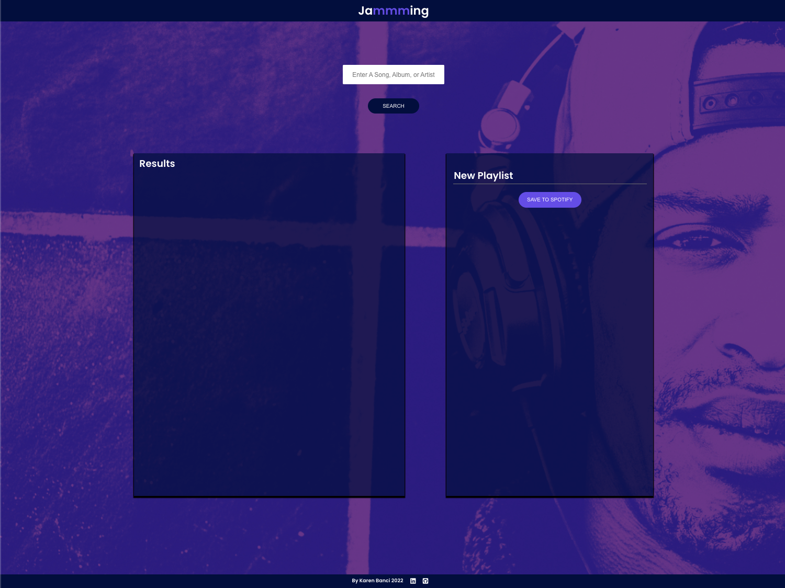
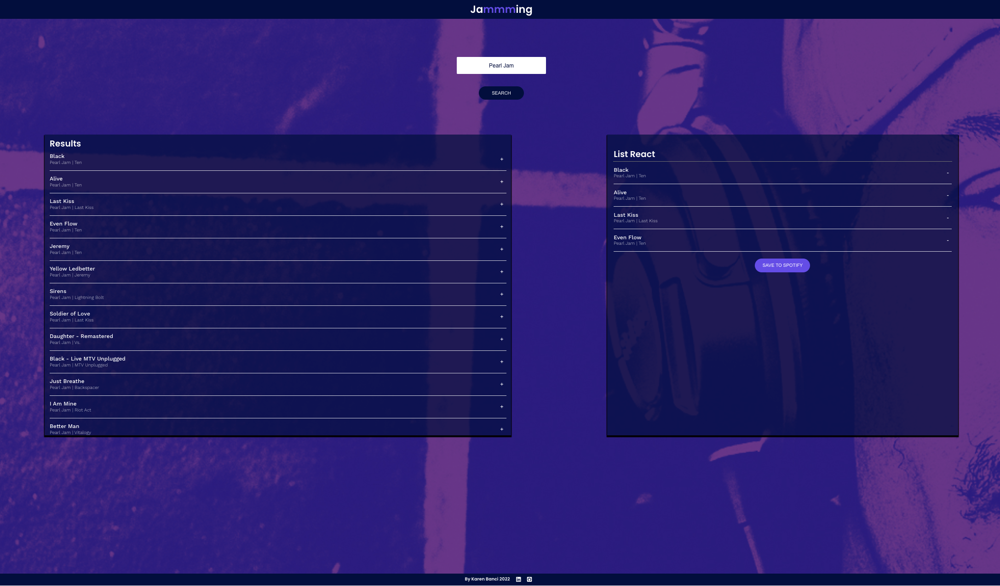
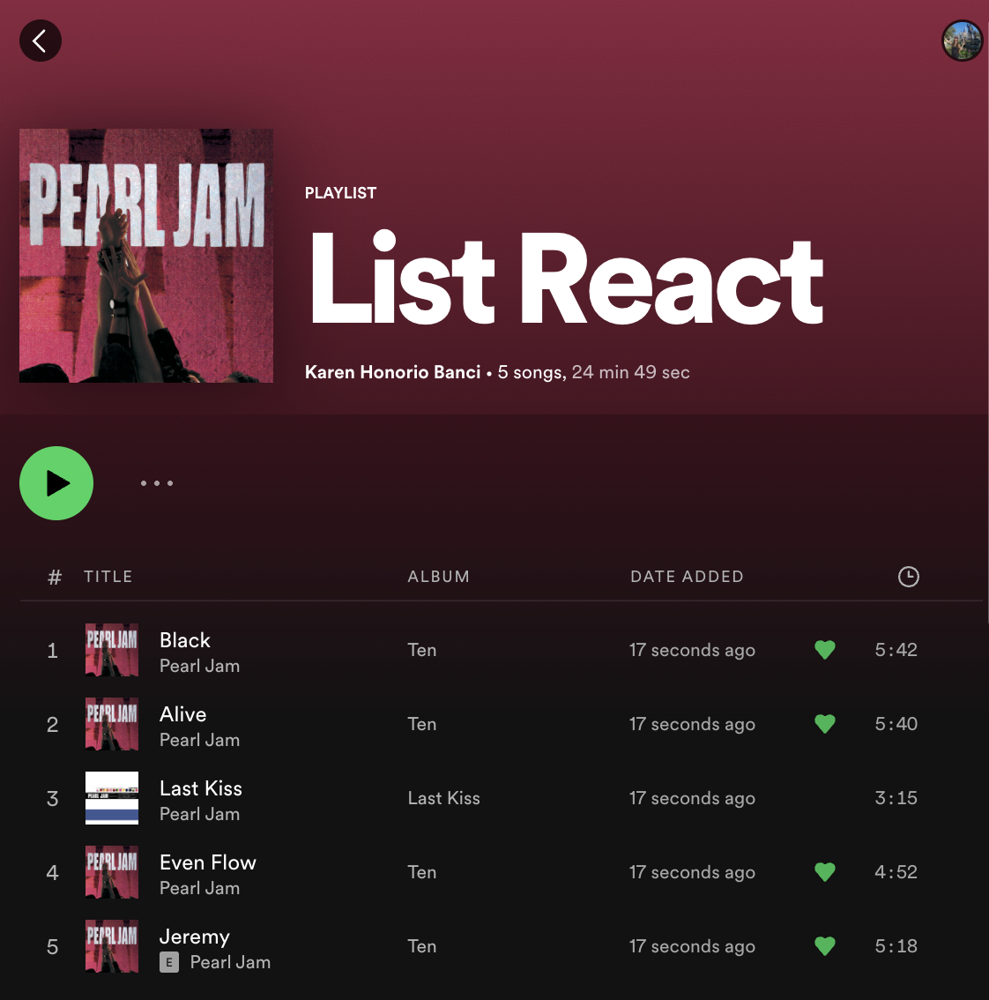

# Jammming

Currently, Jammming supports the ability to create one new playlist at a time and save it to Spotify. However, updating an existing playlist is not supported. With over 5 million playlists created or edited daily on Spotify, this is key functionality to support.

## This feature accomplishes the following

1. Displays a list of the current user's playlists
2. Allows a user to select one of their existing playlists. The application will load the name of that playlist and the tracks of that playlist in the playlist panel.
3. The user may update the name and/or the tracks of the playlist and click "SAVE PLAYLIST". When the user selects "SAVE PLAYLIST", Jammming will save the current version of the playlist to the user's Spotify account.
4. If the user selects a different playlist while the current playlist has unsaved changes, Jammming will load and display the new playlist, and will not save the changes to the old playlist. If the user returns to the old playlist, Jammming will display Spotify's version of the playlist, not the edited version.

### How can I creat a new playlist?

1. This is a layout

2. Making new playlist
In the search bar type the song, album or artist, choose the track that interests you the most. Replace 'New Playlist' with the name you choose. Click on Save to Spotify.

3. Check your playlist
Open your browser in Spotify, click on your library (on the left bar of the browser). Check that your playlist has been created.

## This was my first project created in ReactJS.
Project made to add to my portfolio with the help of Codecademy.
